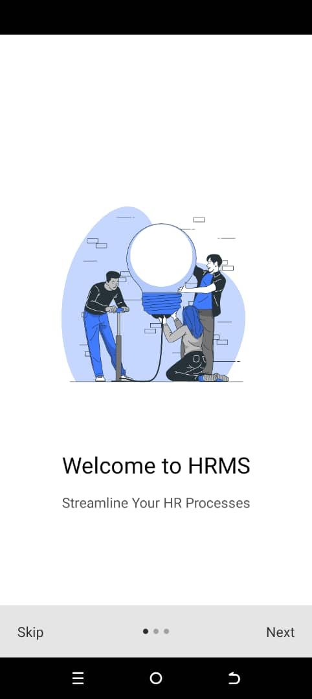

# Human Resource Management System

Human Resource Management system is a mobile app built using React-Native (Front end), and backend using PHP, MySQL.

## Screenshots

### Onboarding Screens

<!-- Display onboarding screens in a single row -->
<p float="left">
  
   
  
</p>

### Login Screen


### Dashboard Screen


## Installation

1. Clone the repository
   ```bash
   git clone https://github.com/Reaganz-Wat/Human-Resource-Management-System.git
