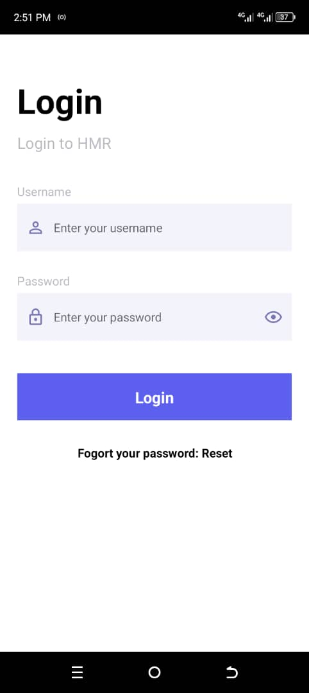
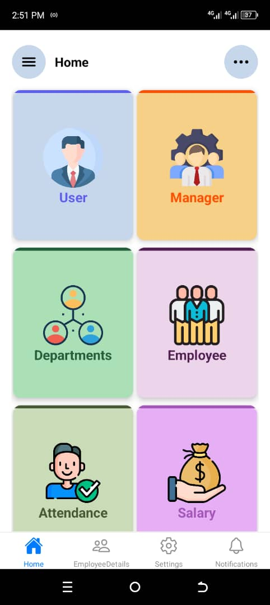

# Human-Resource-Management-System
Human Resource  Management system is a mobile app built using React-Native (Front end), and backend using PHP, MySQL

## Screenshots

### Onboarding Screens


### Login Screen




### Dashboard Screen




## Installation

1. Clone the repository
   ```bash
   git clone https://github.com/Reaganz-Wat/Human-Resource-Management-System.git